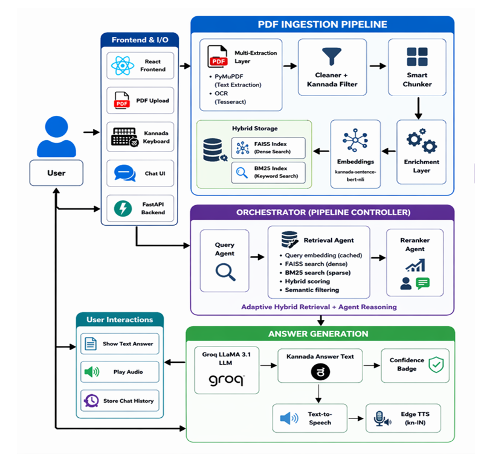

# Kannada RAG System

## Architecture

## Overview

A Kannada Multilingual RAG (Retrieval-Augmented Generation) system that supports:

- PDF ingestion and OCR
- Kannada text extraction
- Hybrid Retrieval (FAISS + BM25)
- Agent-based orchestration
- Groq LLM answer generation
- Kannada Text-to-Speech
- React + FastAPI interface

## Tech Stack

- Python
- FastAPI
- React
- FAISS
- BM25
- Groq LLM
- Tesseract OCR
- Kannada Sentence-BERT
